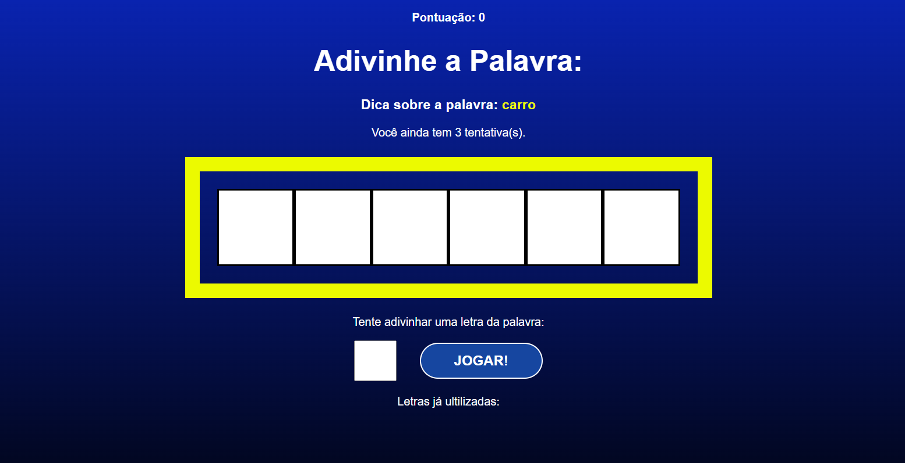

# secret-word-projeto
 Jogo feito em React para descobrir a palavra!

 
 
## Iniciando o projeto:

**1 - Adicione a pasta node_modules com o comando:**
- npm install

**2 - Iniciando aplicação:**
- Use o comando 'npm run dev' para iniciar a aplicação!
- Por o vite por padrão roda na porta '3000'.

(Ainda sem versão Mobile)
